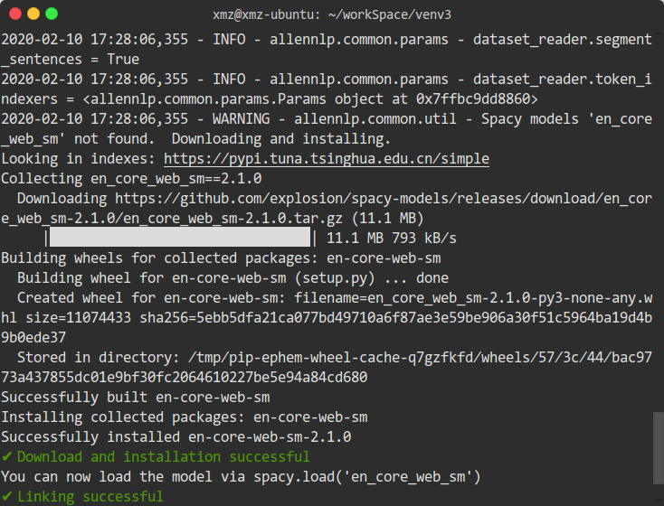

## This is the installation instruction for FRMiner.

We provide two kinds of installation approaches, docker and configuring manually.


## Docker

1. install docker following by [Docker tutorial](https://docs.docker.com/install/)

2. pull docker image by `docker pull zzyo/frminer:v1`

3. enter docker by `docker run -it zzyo/frminer:v1 /bin/bash`

4. enter code folder and run:

    `cd home`
    
    `allennlp train FRMiner/config.json -s FRMiner/out/ -f --include-package FRMiner`
    
    
This training process will take a long time, which depends on the performance of your machine. 
If you just want to test the functions of the code or get an initial trained model, you can set the `num_epochs` field in `config.json` as a small integer number.
    
    
## Configure manually


1. OS: Ubuntu

   Memory: minimum 8G
   
   Hardware: minimum 10G

2. Coding language: Python (v3.6)

3. CUDA: 9.0

    CUDA is optional, and you can run the code on CPU by specifying the `cuda_device` field in `config.json` as `-1`. 

4. Python packages:

    - Allennlp (v0.8.4)
    
        You only need to install `allennlp` via command `pip install allennlp==0.8.4`.
        
        Some extra python packages including `spacy`, `torch`, `tensorflow` etc. will be automatically installed 
        since these packages are dependencies of `allennlp`.
    
        And if the console print `Successfully installed <package name>`, it means that you have installed these python
        packages successfully.
        
        Note that if some errors like `ERROR: No matching distribution found for allennlp==0.8.4` occur, 
        please add a third-party pip mirror resource via `pip config set global.index-url https://pypi.tuna.tsinghua.edu.cn/simple`,
        after that, reinstall your `allennlp`.
    
5.  Code and Data：

    Code is archived in [softwareheritage](https://archive.softwareheritage.org/browse/origin/https://github.com/FRMiner/FRMiner/directory/).
    After acquiring the code, the next step is to download [Glove](http://nlp.stanford.edu/data/glove.6B.zip), then unzip this file and put `glove.6B.50d.txt`
    into `data` folder.

     
6. Run

    Open terminal in the parent folder which is at the same directory level as `FRMiner` and run
    ``allennlp train <config file> -s <serialization path> -f --include-package FRMiner``.
    
    If you are running the code for the first time, the code will automatically download an NLP model `en-core-web-sm`, 
    it takes some time and you do not need to download it later. The following screen shot is the output of downloading 
    the model for the first time. 
    
    
    But if you have downloaded the `en-core-web-sm` before, for example, with `allennlp train FRMiner/config.json -s FRMiner/out/ -f --include-package FRMiner`,
    you can get the following information on your console:
    
    ```bash
    xmz@itechs-HP-Pavilion:~/projects$ allennlp train FRMiner/config.json -s FRMiner/out/ -f --include-package FRMiner
    2020-01-14 16:01:52,900 - INFO - allennlp.common.params - random_seed = 2019
    2020-01-14 16:01:52,900 - INFO - allennlp.common.params - numpy_seed = 2019
    2020-01-14 16:01:52,900 - INFO - allennlp.common.params - pytorch_seed = 2019
    2020-01-14 16:01:53,172 - INFO - allennlp.common.checks - Pytorch version: 1.1.0
    2020-01-14 16:01:53,173 - INFO - allennlp.common.params - evaluate_on_test = False
    2020-01-14 16:01:53,173 - INFO - allennlp.common.params - validation_dataset_reader = None
    2020-01-14 16:01:53,174 - INFO - allennlp.common.from_params - instantiating class <class 'allennlp.data.dataset_readers.dataset_reader.DatasetReader'> from params {'type': 'issue_reader_siamese'} and extras set()
    2020-01-14 16:01:53,174 - INFO - allennlp.common.params - dataset_reader.type = issue_reader_siamese
    2020-01-14 16:01:53,174 - INFO - allennlp.common.from_params - instantiating class <class 'FRMiner.frminer_reader.IssueReaderSiamese'> from params {} and extras set()
    2020-01-14 16:01:53,174 - INFO - allennlp.common.params - dataset_reader.lazy = False
    2020-01-14 16:01:53,174 - INFO - allennlp.common.params - dataset_reader.segment_sentences = True
    2020-01-14 16:01:53,174 - INFO - allennlp.common.params - dataset_reader.token_indexers = <allennlp.common.params.Params object at 0x7f4448b49a90>
    2020-01-14 16:01:53,606 - INFO - allennlp.common.params - train_data_path = FRMiner/data/bootstrap_target_train_0.txt
    2020-01-14 16:01:53,606 - INFO - allennlp.training.util - Reading training data from FRMiner/data/bootstrap_target_train_0.txt
    0it [00:00, ?it/s]2020-01-14 16:01:53,607 - INFO - FRMiner.frminer_reader - Reading instances from lines in file at: FRMiner/data/bootstrap_target_train_0.txt
    2020-01-14 16:01:54,105 - INFO - FRMiner.frminer_reader - Begin training-------
    2020-01-14 16:01:54,113 - WARNING - allennlp.data.fields.sequence_label_field - Your label namespace was 'pos'. We recommend you use a namespace ending with 'labels' or 'tags', so we don't add UNK and PAD tokens by default to your vocabulary.  See documentation for `non_padded_namespaces` parameter in Vocabulary.
    15179it [26:34,  6.27it/s]2020-01-14 16:28:28,495 - INFO - FRMiner.frminer_reader - Dataset Count: Same : 7590 / Diff : 7590
    15180it [26:34,  9.52it/s]
    2020-01-14 16:28:28,496 - INFO - allennlp.common.params - validation_data_path = FRMiner/data/bootstrap_target_test_0.txt
    2020-01-14 16:28:28,496 - INFO - allennlp.training.util - Reading validation data from FRMiner/data/bootstrap_target_test_0.txt
    0it [00:00, ?it/s]2020-01-14 16:28:28,497 - INFO - FRMiner.frminer_reader - Reading instances from lines in file at: FRMiner/data/bootstrap_target_test_0.txt
    2020-01-14 16:28:28,867 - INFO - FRMiner.frminer_reader - Begin training-------
    2020-01-14 16:28:28,867 - INFO - FRMiner.frminer_reader - Reading instances from lines in file at: FRMiner/data/bootstrap_target_train_0.txt
    249it [00:25,  6.59it/s]2020-01-14 16:28:54,291 - INFO - FRMiner.frminer_reader - Dataset Count: Same : 126 / Diff : 126
    252it [00:25,  9.77it/s]
    2020-01-14 16:28:54,291 - INFO - allennlp.common.params - test_data_path = None
    2020-01-14 16:28:54,351 - INFO - allennlp.training.trainer - From dataset instances, validation, train will be considered for vocabulary creation.
    2020-01-14 16:28:54,352 - INFO - allennlp.common.params - vocabulary.type = None
    2020-01-14 16:28:54,352 - INFO - allennlp.common.params - vocabulary.extend = False
    2020-01-14 16:28:54,352 - INFO - allennlp.common.params - vocabulary.directory_path = None
    2020-01-14 16:28:54,352 - INFO - allennlp.common.params - vocabulary.min_count = None
    2020-01-14 16:28:54,352 - INFO - allennlp.common.params - vocabulary.max_vocab_size = None
    2020-01-14 16:28:54,353 - INFO - allennlp.common.params - vocabulary.non_padded_namespaces = ('*tags', '*labels')
    2020-01-14 16:28:54,353 - INFO - allennlp.common.params - vocabulary.min_pretrained_embeddings = None
    2020-01-14 16:28:54,353 - INFO - allennlp.common.params - vocabulary.only_include_pretrained_words = False
    2020-01-14 16:28:54,353 - INFO - allennlp.common.params - vocabulary.tokens_to_add = None
    2020-01-14 16:28:54,353 - INFO - allennlp.data.vocabulary - Fitting token dictionary from dataset.
    15432it [00:01, 9555.25it/s]
    2020-01-14 16:28:55,974 - INFO - allennlp.common.from_params - instantiating class <class 'allennlp.models.model.Model'> from params {'pos_tag_embedding': {'embedding_dim': 50, 'sparse': True, 'vocab_namespace': 'pos'}, 'text_field_embedder': {'tokens': {'embedding_dim': 50, 'pretrained_file': 'FRMiner/data/glove.6B.50d.txt', 'trainable': True, 'type': 'embedding'}}, 'type': 'FRModel'} and extras {'vocab'}
    2020-01-14 16:28:55,974 - INFO - allennlp.common.params - model.type = FRModel
    2020-01-14 16:28:55,974 - INFO - allennlp.common.from_params - instantiating class <class 'FRMiner.frminer_model.FRModel'> from params {'pos_tag_embedding': {'embedding_dim': 50, 'sparse': True, 'vocab_namespace': 'pos'}, 'text_field_embedder': {'tokens': {'embedding_dim': 50, 'pretrained_file': 'FRMiner/data/glove.6B.50d.txt', 'trainable': True, 'type': 'embedding'}}} and extras {'vocab'}
    2020-01-14 16:28:55,974 - INFO - allennlp.common.from_params - instantiating class <class 'allennlp.modules.text_field_embedders.text_field_embedder.TextFieldEmbedder'> from params {'tokens': {'embedding_dim': 50, 'pretrained_file': 'FRMiner/data/glove.6B.50d.txt', 'trainable': True, 'type': 'embedding'}} and extras {'vocab'}
    2020-01-14 16:28:55,974 - INFO - allennlp.common.params - model.text_field_embedder.type = basic
    2020-01-14 16:28:55,974 - INFO - allennlp.common.params - model.text_field_embedder.embedder_to_indexer_map = None
    2020-01-14 16:28:55,974 - INFO - allennlp.common.params - model.text_field_embedder.allow_unmatched_keys = False
    2020-01-14 16:28:55,975 - INFO - allennlp.common.params - model.text_field_embedder.token_embedders = None
    2020-01-14 16:28:55,975 - INFO - allennlp.common.from_params - instantiating class <class 'allennlp.modules.token_embedders.token_embedder.TokenEmbedder'> from params {'embedding_dim': 50, 'pretrained_file': 'FRMiner/data/glove.6B.50d.txt', 'trainable': True, 'type': 'embedding'} and extras {'vocab'}
    2020-01-14 16:28:55,975 - INFO - allennlp.common.params - model.text_field_embedder.tokens.type = embedding
    2020-01-14 16:28:55,975 - INFO - allennlp.common.params - model.text_field_embedder.tokens.num_embeddings = None
    2020-01-14 16:28:55,975 - INFO - allennlp.common.params - model.text_field_embedder.tokens.vocab_namespace = tokens
    2020-01-14 16:28:55,975 - INFO - allennlp.common.params - model.text_field_embedder.tokens.embedding_dim = 50
    2020-01-14 16:28:55,975 - INFO - allennlp.common.params - model.text_field_embedder.tokens.pretrained_file = FRMiner/data/glove.6B.50d.txt
    2020-01-14 16:28:55,975 - INFO - allennlp.common.params - model.text_field_embedder.tokens.projection_dim = None
    2020-01-14 16:28:55,975 - INFO - allennlp.common.params - model.text_field_embedder.tokens.trainable = True
    2020-01-14 16:28:55,975 - INFO - allennlp.common.params - model.text_field_embedder.tokens.padding_index = None
    2020-01-14 16:28:55,975 - INFO - allennlp.common.params - model.text_field_embedder.tokens.max_norm = None
    2020-01-14 16:28:55,975 - INFO - allennlp.common.params - model.text_field_embedder.tokens.norm_type = 2.0
    2020-01-14 16:28:55,975 - INFO - allennlp.common.params - model.text_field_embedder.tokens.scale_grad_by_freq = False
    2020-01-14 16:28:55,975 - INFO - allennlp.common.params - model.text_field_embedder.tokens.sparse = False
    2020-01-14 16:28:55,976 - INFO - allennlp.modules.token_embedders.embedding - Reading pretrained embeddings from file
    400000it [00:00, 972044.51it/s]
    2020-01-14 16:28:56,411 - INFO - allennlp.modules.token_embedders.embedding - Initializing pre-trained embedding layer
    2020-01-14 16:28:56,650 - INFO - allennlp.modules.token_embedders.embedding - Pretrained embeddings were found for 1784 out of 2884 tokens
    2020-01-14 16:28:56,659 - INFO - allennlp.common.params - model.pos_tag_embedding.num_embeddings = None
    2020-01-14 16:28:56,659 - INFO - allennlp.common.params - model.pos_tag_embedding.vocab_namespace = pos
    2020-01-14 16:28:56,659 - INFO - allennlp.common.params - model.pos_tag_embedding.embedding_dim = 50
    2020-01-14 16:28:56,659 - INFO - allennlp.common.params - model.pos_tag_embedding.pretrained_file = None
    2020-01-14 16:28:56,660 - INFO - allennlp.common.params - model.pos_tag_embedding.projection_dim = None
    2020-01-14 16:28:56,660 - INFO - allennlp.common.params - model.pos_tag_embedding.trainable = True
    2020-01-14 16:28:56,660 - INFO - allennlp.common.params - model.pos_tag_embedding.padding_index = None
    2020-01-14 16:28:56,660 - INFO - allennlp.common.params - model.pos_tag_embedding.max_norm = None
    2020-01-14 16:28:56,660 - INFO - allennlp.common.params - model.pos_tag_embedding.norm_type = 2.0
    2020-01-14 16:28:56,660 - INFO - allennlp.common.params - model.pos_tag_embedding.scale_grad_by_freq = False
    2020-01-14 16:28:56,660 - INFO - allennlp.common.params - model.pos_tag_embedding.sparse = True
    2020-01-14 16:28:56,660 - INFO - allennlp.common.params - model.dropout = 0.1
    2020-01-14 16:28:56,660 - INFO - allennlp.common.params - model.label_namespace = labels
    2020-01-14 16:28:56,689 - INFO - allennlp.nn.initializers - Initializing parameters
    2020-01-14 16:28:56,690 - INFO - allennlp.nn.initializers - Done initializing parameters; the following parameters are using their default initialization from their code
    2020-01-14 16:28:56,690 - INFO - allennlp.nn.initializers -    _bilinear_sim._bias
    2020-01-14 16:28:56,690 - INFO - allennlp.nn.initializers -    _bilinear_sim._weight_matrix
    2020-01-14 16:28:56,690 - INFO - allennlp.nn.initializers -    _comment_cnn.conv_layer_0.bias
    2020-01-14 16:28:56,690 - INFO - allennlp.nn.initializers -    _comment_cnn.conv_layer_0.weight
    2020-01-14 16:28:56,691 - INFO - allennlp.nn.initializers -    _comment_cnn.conv_layer_1.bias
    2020-01-14 16:28:56,691 - INFO - allennlp.nn.initializers -    _comment_cnn.conv_layer_1.weight
    2020-01-14 16:28:56,691 - INFO - allennlp.nn.initializers -    _comment_cnn.conv_layer_2.bias
    2020-01-14 16:28:56,691 - INFO - allennlp.nn.initializers -    _comment_cnn.conv_layer_2.weight
    2020-01-14 16:28:56,691 - INFO - allennlp.nn.initializers -    _comment_cnn.conv_layer_3.bias
    2020-01-14 16:28:56,691 - INFO - allennlp.nn.initializers -    _comment_cnn.conv_layer_3.weight
    2020-01-14 16:28:56,691 - INFO - allennlp.nn.initializers -    _encoder._module.bias_hh_l0
    2020-01-14 16:28:56,691 - INFO - allennlp.nn.initializers -    _encoder._module.bias_hh_l0_reverse
    2020-01-14 16:28:56,691 - INFO - allennlp.nn.initializers -    _encoder._module.bias_ih_l0
    2020-01-14 16:28:56,691 - INFO - allennlp.nn.initializers -    _encoder._module.bias_ih_l0_reverse
    2020-01-14 16:28:56,691 - INFO - allennlp.nn.initializers -    _encoder._module.weight_hh_l0
    2020-01-14 16:28:56,691 - INFO - allennlp.nn.initializers -    _encoder._module.weight_hh_l0_reverse
    2020-01-14 16:28:56,692 - INFO - allennlp.nn.initializers -    _encoder._module.weight_ih_l0
    2020-01-14 16:28:56,692 - INFO - allennlp.nn.initializers -    _encoder._module.weight_ih_l0_reverse
    2020-01-14 16:28:56,692 - INFO - allennlp.nn.initializers -    _pos_tag_embedding.weight
    2020-01-14 16:28:56,692 - INFO - allennlp.nn.initializers -    _projector._linear_layers.0.bias
    2020-01-14 16:28:56,692 - INFO - allennlp.nn.initializers -    _projector._linear_layers.0.weight
    2020-01-14 16:28:56,692 - INFO - allennlp.nn.initializers -    _projector._linear_layers.1.bias
    2020-01-14 16:28:56,692 - INFO - allennlp.nn.initializers -    _projector._linear_layers.1.weight
    2020-01-14 16:28:56,692 - INFO - allennlp.nn.initializers -    _report_cnn.conv_layer_0.bias
    2020-01-14 16:28:56,692 - INFO - allennlp.nn.initializers -    _report_cnn.conv_layer_0.weight
    2020-01-14 16:28:56,692 - INFO - allennlp.nn.initializers -    _report_cnn.conv_layer_1.bias
    2020-01-14 16:28:56,692 - INFO - allennlp.nn.initializers -    _report_cnn.conv_layer_1.weight
    2020-01-14 16:28:56,693 - INFO - allennlp.nn.initializers -    _report_cnn.conv_layer_2.bias
    2020-01-14 16:28:56,693 - INFO - allennlp.nn.initializers -    _report_cnn.conv_layer_2.weight
    2020-01-14 16:28:56,693 - INFO - allennlp.nn.initializers -    _report_cnn.conv_layer_3.bias
    2020-01-14 16:28:56,693 - INFO - allennlp.nn.initializers -    _report_cnn.conv_layer_3.weight
    2020-01-14 16:28:56,693 - INFO - allennlp.nn.initializers -    _seq2vec.conv_layer_0.bias
    2020-01-14 16:28:56,693 - INFO - allennlp.nn.initializers -    _seq2vec.conv_layer_0.weight
    2020-01-14 16:28:56,693 - INFO - allennlp.nn.initializers -    _seq2vec.conv_layer_1.bias
    2020-01-14 16:28:56,693 - INFO - allennlp.nn.initializers -    _seq2vec.conv_layer_1.weight
    2020-01-14 16:28:56,693 - INFO - allennlp.nn.initializers -    _seq2vec.conv_layer_2.bias
    2020-01-14 16:28:56,693 - INFO - allennlp.nn.initializers -    _seq2vec.conv_layer_2.weight
    2020-01-14 16:28:56,693 - INFO - allennlp.nn.initializers -    _seq2vec.conv_layer_3.bias
    2020-01-14 16:28:56,693 - INFO - allennlp.nn.initializers -    _seq2vec.conv_layer_3.weight
    2020-01-14 16:28:56,694 - INFO - allennlp.nn.initializers -    _text_field_embedder.token_embedder_tokens.weight
    2020-01-14 16:28:56,704 - INFO - allennlp.common.from_params - instantiating class <class 'allennlp.data.iterators.data_iterator.DataIterator'> from params {'batch_size': 32, 'sorting_keys': [['dialog1', 'num_fields']], 'type': 'bucket'} and extras set()
    2020-01-14 16:28:56,704 - INFO - allennlp.common.params - iterator.type = bucket
    2020-01-14 16:28:56,704 - INFO - allennlp.common.from_params - instantiating class <class 'allennlp.data.iterators.bucket_iterator.BucketIterator'> from params {'batch_size': 32, 'sorting_keys': [['dialog1', 'num_fields']]} and extras set()
    2020-01-14 16:28:56,704 - INFO - allennlp.common.params - iterator.sorting_keys = [['dialog1', 'num_fields']]
    2020-01-14 16:28:56,704 - INFO - allennlp.common.params - iterator.padding_noise = 0.1
    2020-01-14 16:28:56,704 - INFO - allennlp.common.params - iterator.biggest_batch_first = False
    2020-01-14 16:28:56,704 - INFO - allennlp.common.params - iterator.batch_size = 32
    2020-01-14 16:28:56,705 - INFO - allennlp.common.params - iterator.instances_per_epoch = None
    2020-01-14 16:28:56,705 - INFO - allennlp.common.params - iterator.max_instances_in_memory = None
    2020-01-14 16:28:56,705 - INFO - allennlp.common.params - iterator.cache_instances = False
    2020-01-14 16:28:56,705 - INFO - allennlp.common.params - iterator.track_epoch = False
    2020-01-14 16:28:56,705 - INFO - allennlp.common.params - iterator.maximum_samples_per_batch = None
    2020-01-14 16:28:56,705 - INFO - allennlp.common.params - validation_iterator = None
    2020-01-14 16:28:56,705 - INFO - allennlp.common.params - trainer.no_grad = ()
    2020-01-14 16:28:56,705 - INFO - allennlp.training.trainer - Following parameters are Frozen  (without gradient):
    2020-01-14 16:28:56,705 - INFO - allennlp.training.trainer - Following parameters are Tunable (with gradient):
    2020-01-14 16:28:56,705 - INFO - allennlp.training.trainer - _text_field_embedder.token_embedder_tokens.weight
    2020-01-14 16:28:56,706 - INFO - allennlp.training.trainer - _pos_tag_embedding.weight
    2020-01-14 16:28:56,706 - INFO - allennlp.training.trainer - _report_cnn.conv_layer_0.weight
    2020-01-14 16:28:56,706 - INFO - allennlp.training.trainer - _report_cnn.conv_layer_0.bias
    2020-01-14 16:28:56,706 - INFO - allennlp.training.trainer - _report_cnn.conv_layer_1.weight
    2020-01-14 16:28:56,706 - INFO - allennlp.training.trainer - _report_cnn.conv_layer_1.bias
    2020-01-14 16:28:56,706 - INFO - allennlp.training.trainer - _report_cnn.conv_layer_2.weight
    2020-01-14 16:28:56,706 - INFO - allennlp.training.trainer - _report_cnn.conv_layer_2.bias
    2020-01-14 16:28:56,706 - INFO - allennlp.training.trainer - _report_cnn.conv_layer_3.weight
    2020-01-14 16:28:56,706 - INFO - allennlp.training.trainer - _report_cnn.conv_layer_3.bias
    2020-01-14 16:28:56,706 - INFO - allennlp.training.trainer - _comment_cnn.conv_layer_0.weight
    2020-01-14 16:28:56,706 - INFO - allennlp.training.trainer - _comment_cnn.conv_layer_0.bias
    2020-01-14 16:28:56,706 - INFO - allennlp.training.trainer - _comment_cnn.conv_layer_1.weight
    2020-01-14 16:28:56,706 - INFO - allennlp.training.trainer - _comment_cnn.conv_layer_1.bias
    2020-01-14 16:28:56,706 - INFO - allennlp.training.trainer - _comment_cnn.conv_layer_2.weight
    2020-01-14 16:28:56,706 - INFO - allennlp.training.trainer - _comment_cnn.conv_layer_2.bias
    2020-01-14 16:28:56,706 - INFO - allennlp.training.trainer - _comment_cnn.conv_layer_3.weight
    2020-01-14 16:28:56,706 - INFO - allennlp.training.trainer - _comment_cnn.conv_layer_3.bias
    2020-01-14 16:28:56,706 - INFO - allennlp.training.trainer - _encoder._module.weight_ih_l0
    2020-01-14 16:28:56,706 - INFO - allennlp.training.trainer - _encoder._module.weight_hh_l0
    2020-01-14 16:28:56,706 - INFO - allennlp.training.trainer - _encoder._module.bias_ih_l0
    2020-01-14 16:28:56,707 - INFO - allennlp.training.trainer - _encoder._module.bias_hh_l0
    2020-01-14 16:28:56,707 - INFO - allennlp.training.trainer - _encoder._module.weight_ih_l0_reverse
    2020-01-14 16:28:56,707 - INFO - allennlp.training.trainer - _encoder._module.weight_hh_l0_reverse
    2020-01-14 16:28:56,707 - INFO - allennlp.training.trainer - _encoder._module.bias_ih_l0_reverse
    2020-01-14 16:28:56,707 - INFO - allennlp.training.trainer - _encoder._module.bias_hh_l0_reverse
    2020-01-14 16:28:56,707 - INFO - allennlp.training.trainer - _seq2vec.conv_layer_0.weight
    2020-01-14 16:28:56,707 - INFO - allennlp.training.trainer - _seq2vec.conv_layer_0.bias
    2020-01-14 16:28:56,707 - INFO - allennlp.training.trainer - _seq2vec.conv_layer_1.weight
    2020-01-14 16:28:56,707 - INFO - allennlp.training.trainer - _seq2vec.conv_layer_1.bias
    2020-01-14 16:28:56,707 - INFO - allennlp.training.trainer - _seq2vec.conv_layer_2.weight
    2020-01-14 16:28:56,707 - INFO - allennlp.training.trainer - _seq2vec.conv_layer_2.bias
    2020-01-14 16:28:56,707 - INFO - allennlp.training.trainer - _seq2vec.conv_layer_3.weight
    2020-01-14 16:28:56,707 - INFO - allennlp.training.trainer - _seq2vec.conv_layer_3.bias
    2020-01-14 16:28:56,707 - INFO - allennlp.training.trainer - _bilinear_sim._weight_matrix
    2020-01-14 16:28:56,707 - INFO - allennlp.training.trainer - _bilinear_sim._bias
    2020-01-14 16:28:56,707 - INFO - allennlp.training.trainer - _projector._linear_layers.0.weight
    2020-01-14 16:28:56,707 - INFO - allennlp.training.trainer - _projector._linear_layers.0.bias
    2020-01-14 16:28:56,707 - INFO - allennlp.training.trainer - _projector._linear_layers.1.weight
    2020-01-14 16:28:56,707 - INFO - allennlp.training.trainer - _projector._linear_layers.1.bias
    2020-01-14 16:28:56,707 - INFO - allennlp.common.params - trainer.patience = 10
    2020-01-14 16:28:56,707 - INFO - allennlp.common.params - trainer.validation_metric = +s_fmeasure
    2020-01-14 16:28:56,708 - INFO - allennlp.common.params - trainer.shuffle = True
    2020-01-14 16:28:56,708 - INFO - allennlp.common.params - trainer.num_epochs = 100
    2020-01-14 16:28:56,708 - INFO - allennlp.common.params - trainer.cuda_device = -1
    2020-01-14 16:28:56,708 - INFO - allennlp.common.params - trainer.grad_norm = None
    2020-01-14 16:28:56,708 - INFO - allennlp.common.params - trainer.grad_clipping = None
    2020-01-14 16:28:56,708 - INFO - allennlp.common.params - trainer.learning_rate_scheduler = None
    2020-01-14 16:28:56,708 - INFO - allennlp.common.params - trainer.momentum_scheduler = None
    2020-01-14 16:28:56,708 - INFO - allennlp.common.params - trainer.optimizer.type = dense_sparse_adam
    2020-01-14 16:28:56,708 - INFO - allennlp.common.params - trainer.optimizer.parameter_groups = None
    2020-01-14 16:28:56,708 - INFO - allennlp.training.optimizers - Number of trainable parameters: 734803
    2020-01-14 16:28:56,708 - INFO - allennlp.common.params - trainer.optimizer.infer_type_and_cast = True
    2020-01-14 16:28:56,708 - INFO - allennlp.common.params - Converting Params object to dict; logging of default values will not occur when dictionary parameters are used subsequently.
    2020-01-14 16:28:56,708 - INFO - allennlp.common.params - CURRENTLY DEFINED PARAMETERS: 
    2020-01-14 16:28:56,708 - INFO - allennlp.common.params - trainer.optimizer.betas = [0.9, 0.9]
    2020-01-14 16:28:56,709 - INFO - allennlp.common.params - trainer.num_serialized_models_to_keep = 20
    2020-01-14 16:28:56,709 - INFO - allennlp.common.params - trainer.keep_serialized_model_every_num_seconds = None
    2020-01-14 16:28:56,709 - INFO - allennlp.common.params - trainer.model_save_interval = None
    2020-01-14 16:28:56,709 - INFO - allennlp.common.params - trainer.summary_interval = 100
    2020-01-14 16:28:56,709 - INFO - allennlp.common.params - trainer.histogram_interval = None
    2020-01-14 16:28:56,709 - INFO - allennlp.common.params - trainer.should_log_parameter_statistics = True
    2020-01-14 16:28:56,709 - INFO - allennlp.common.params - trainer.should_log_learning_rate = False
    2020-01-14 16:28:56,709 - INFO - allennlp.common.params - trainer.log_batch_size_period = None
    2020-01-14 16:28:56,710 - INFO - allennlp.training.trainer - Beginning training.
    2020-01-14 16:28:56,710 - INFO - allennlp.training.trainer - Epoch 0/99
    2020-01-14 16:28:56,710 - INFO - allennlp.training.trainer - Peak CPU memory usage MB: 1507.02
    2020-01-14 16:28:56,764 - INFO - allennlp.training.trainer - GPU 0 memory usage MB: 10
    2020-01-14 16:28:56,764 - INFO - allennlp.training.trainer - Training
    2020-01-14 16:34:00,548 - INFO - allennlp.training.trainer - Validating
    2020-01-14 16:34:01,966 - INFO - allennlp.training.tensorboard_writer -                     Training |  Validation
    2020-01-14 16:34:01,967 - INFO - allennlp.training.tensorboard_writer - s_precision     |     0.693  |     0.694
    2020-01-14 16:34:01,967 - INFO - allennlp.training.tensorboard_writer - fscore          |     0.695  |     0.797
    2020-01-14 16:34:01,967 - INFO - allennlp.training.tensorboard_writer - gpu_0_memory_MB |    10.000  |       N/A
    2020-01-14 16:34:01,968 - INFO - allennlp.training.tensorboard_writer - accuracy        |     0.701  |     0.774
    2020-01-14 16:34:01,968 - INFO - allennlp.training.tensorboard_writer - s_recall        |     0.720  |     0.721
    2020-01-14 16:34:01,968 - INFO - allennlp.training.tensorboard_writer - loss            |     0.533  |     0.518
    2020-01-14 16:34:01,968 - INFO - allennlp.training.tensorboard_writer - cpu_memory_MB   |  1507.020  |       N/A
    2020-01-14 16:34:01,969 - INFO - allennlp.training.tensorboard_writer - s_fmeasure      |     0.706  |     0.708
    2020-01-14 16:34:01,969 - INFO - allennlp.training.tensorboard_writer - precision       |     0.709  |     0.723
    2020-01-14 16:34:01,969 - INFO - allennlp.training.tensorboard_writer - recall          |     0.681  |     0.889
    2020-01-14 16:34:02,009 - INFO - allennlp.training.checkpointer - Best validation performance so far. Copying weights to 'FRMiner/out//best.th'.
    2020-01-14 16:34:02,015 - INFO - allennlp.training.trainer - Epoch duration: 0:05:05.305213
    2020-01-14 16:34:02,017 - INFO - allennlp.training.trainer - Estimated training time remaining: 8:23:45
    .........
    .........
    .........
    
    ```
    
    the log showed above means that the required environment have been configured successfully, and the code is running.
    
    