# Causal Testing Artifact (ICSE 2020)

This is the artifact for the paper *"Causal Testing: Understanding
Defects' Root Causes"*. This artifact facilitates the use of Holmes for debugging defects and re-use of the implementation and/or artifacts in other research studies.

## What is included in this artifact?

Our artifact includes the following:

1. Holmes, our prototype Causal Testing implementation.

2. A virtual machine that facilitates the use of Holmes, our Causal Testing prototype.


## Where can I obtain the artifact components?

All the above listed artifacts, with the exception of the virtual machine file, are located in this repository.

## Setting up the virtual machine
*Copied from INSTALL.md*

1. Download <a href="https://www.virtualbox.org" target="_blank">VirtualBox</a>.
2. Download virtual machine file <a href="https://drive.google.com/open?id=1hyzHYCQEkOzYiLGldkBVxNvQt0Phb-th" target="_blank">CausalTesting_Artifact.ova</a>.
<br> **Please note this is a large file (5BG) and may take some time to download.**
3. Open VirtualBox.
4. Go to **File > Import Appliance...**
5. Find and select the downloaded virtual machine file (CausalTesting_Artifact.ova). Click **"Continue"**.
6. Leave all the settings as they are and click **"Import"**.

Once the virtual machine is imported, it will appear in your VirtualBox Manager as **CausalTesting_Artifact**. 

You can now start the virtual machine by clicking the green **"Start"** arrow at the top of the VirtualBox Manager (see screenshot below).

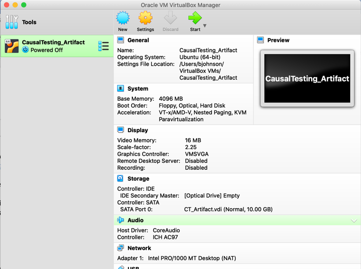

### Resizing the virtual machine screen

If the virtual machine loads and you find it is not an appropriate size, you can find the size that works for you by doing the following:

1. In your VirtualBox VM menu, go to **View > Virtual Screen 1 > ...**. You will see different scaling options; select the one that best suites your screen.

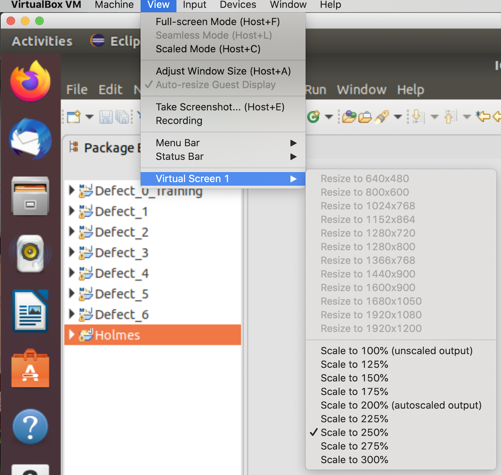

2. Your menu may look different if you are running a different operating system. However, if given percentages to re-scale they will have the same effect.

### Waking up the virtual machine

If you leave the virtual machine and return to a black screen or screen saver, press any key on your keyboard to wake up the virtual machine.

## Loading and navigating Eclipse

Once the virtual machine loads, Eclipse will open. In Eclipse, there will be 8 projects loaded on the left side in the Project Explorer. Seven of the projects are from the <a href="https://github.com/rjust/defects4j" target="_blank">Defects4J</a> defect benchmark; these projects are labeled *Defect_0_Training*, *Defect_1*, *Defect_2*, *Defect_3*, *Defect_4*, *Defect_5*, and *Defect_6*. The eighth project is *Holmes*. 

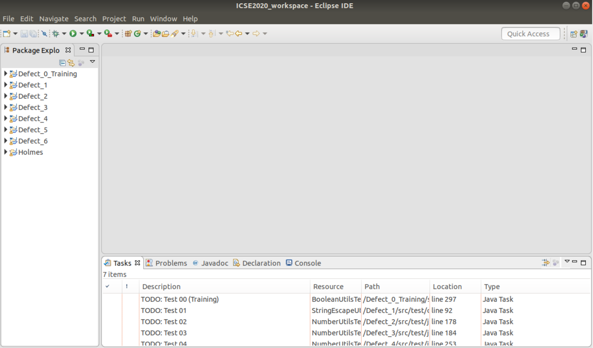

At the bottom of the window, the Tasks View is open with a list of TODOs. Each TODO maps to a failing test in its respective project that exposes a defect in that project's source code. 
For example **TODO: Test 00 (Training)** maps to a failing test in the project *Defect_0_Training* that exposes a defect.

You may get a "Low Disk Space" warning -- you can click "Ignore". Running Holmes doesn't require a significant amount of memory.

## Holmes runtime

The runtime for Holmes varies depending on a number of factors, such as input value, input difference threshold, and project size. The current version of Holmes works on tests for single parameter methods that take either a primitive type or String. To replicate Holmes' runtime when generating tests, do the following:

1. Double-click the TODO labeled **TODO: Test 00 (Training)**. Within a few seconds, the file *BooleanUtilsTest.java* opens at the ```test_toBoolean_String()``` method. Inside the ```test_toBoolean_String()``` method is the failing test ```assertEquals(false, BooleanUtils.toBoolean("tru");```.

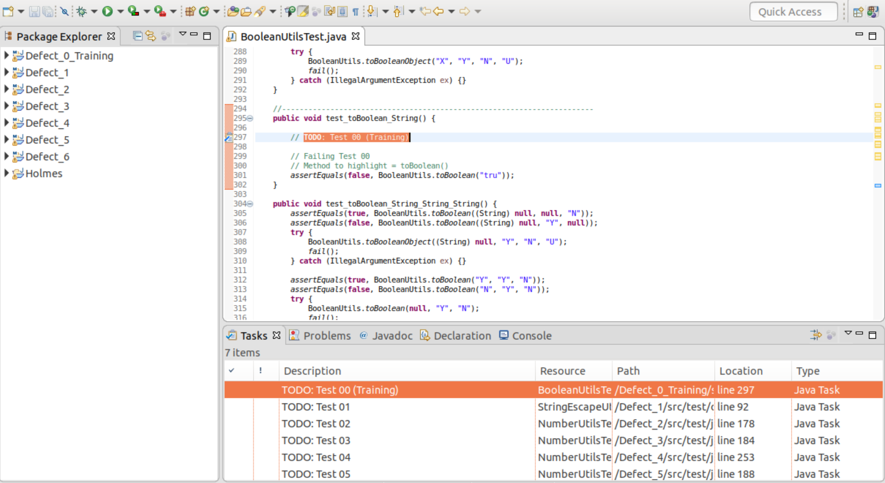

2. Double-click the method call ```toBoolean``` so that it is highlighted, as shown in the screenshot below.


3. Right-click the highlighted method and click **"Run Holmes"** in the pop-up menu (shown below). The editor will automatically go to the top of the file and some dialog windows may pop up as Holmes generates and executes tests. This process will take a minute or two; to reduce the chances of Holmes or the virtual machine hanging, we selected a defect for which Holmes is quickly able to find similar passing tests.

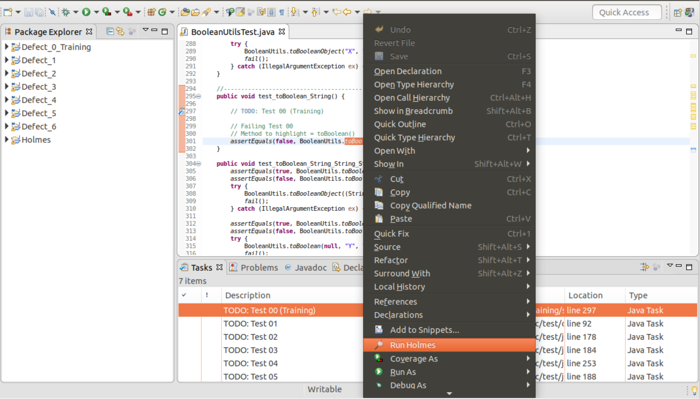

Eventually, a view labeled "Holmes View" will open at the bottom of the screen with the results of the execution (as shown below). 

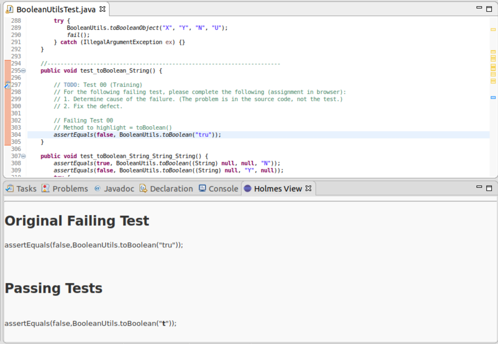

Now let's see how we can use Causal Testing to debug.

## Debugging with Holmes

Holmes is a prototype implementation of our novel testing technique, Causal Testing. Causal Testing uses causal experiments, which involves perturbing test inputs to find passing executions that are similar to the failing execution, to help developers understand why a given test is failing and how to fix it.

To see how you can use Causal Testing to debug a failing test, we first need to produce the output:

1. Double-click the TODO labled **TODO: Test 01**. This will open the file *StringEscapeUtilsTest.java* at the ```testEscapeJavaWithSlash()``` test method. Inside the test method is the following failing test:

```
String input = "String with a slash (/) in it";
final String expected = input;
final String actual = StringEscapeUtils.escapeJava(input);

assertEquals(expected, actual);
```

2. For this test, the method call being tested is ```escapeJava(input)```. Therefore, to invoke Holmes we want to double-click to highlight ```escapeJava```, as shown below.


3. Right click the highlighted method and select **Run Holmes** from the pop-up menu. The output will appear at the bottom of the screen in the "Holmes View"


Now that we have the Causal Testing results, we can begin to debug the defect.

### Determining defect cause

First, we can see that Holmes has provided three similar passing tests and three similar failing tests. Just from looking at the inputs to the tests that pass and the tests that fail we can see that, like the original failing test, all the additional failing tests include the ```/``` character while the tests that pass do not. This suggests the defect has something to do with the presence of the ```/``` in the input string.

Second, we can see that each test that Holmes generated has a button under it labeled "See Execution Trace". Clicking this button opens a minimized trace of the execution; clicking the button again hides the trace.

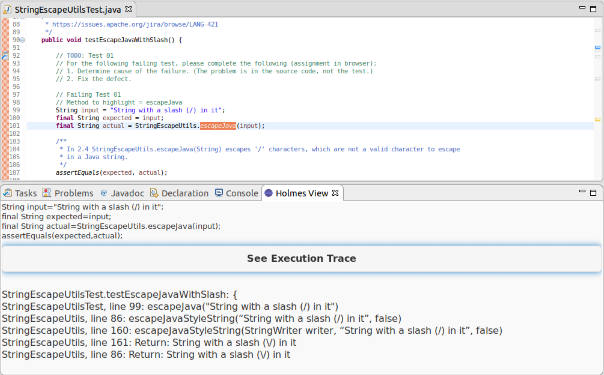

Let's look at the trace for the most similar passing input, ```"String with a slash in it"```:


We can see that the final method call to ```escapeJavaStyleString``` returns the same string that was input, as the test expected (```assertEquals(expected,actual)```). When we look at the trace for the original failing test, we can see that this same method call adds an additional character to the input string (```String with a slash (\/) in it```), causing the test to fail.

### Repairing the defect

Based on the information above, we can hypothesize that the cause of this defect is the mishandling of the ```/``` character in the ```escapeJavaStyleString``` method. Now let's see if we can find where this happening and how we can fix it.

To navigate to this final method call ```escapeJavaStyleString``` in Eclipse, do the following:

1. Press and hold the *control* button on your keyboard and hover over the ```escapeJava``` method call in the test method. The method should become a link and open a pop-up menu, as shown in the screenshot below.

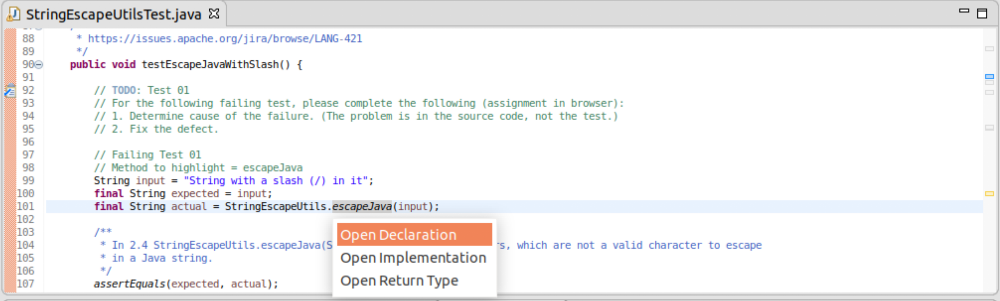

2. Click "Open Declaration" in the pop-up menu. This will take you to the ```escapeJava``` method implementation in the ```StringEscapeutils``` class.

3. Still following the trace provided by Holmes, we repeat Step 1 on the ```escapeJavaStyleString``` method call inside the ```escapeJava``` method.

4. The trace indicates that is one more method call to another method named ```escapeJavaStyleString``` inside the ```escapeJavaStyleString``` method. We repeat Step 1 one last time on this last call to ```escapeJavaStyleString``` and find ourselves in the final method of the execution.

Knowing that the part of the input causing the problem is the ```/``` character, we can begin by skimming the method for where this character is (or isn't) handled. Eventually we get to line 243, where we see the case for the ```/``` character and we can see where the extra character in the failing test output is coming from:

```
case '/':
  out.write("\\");
  out.write("/");
```

Given this code exists, we can assume that just erasing this case may fix this defect but cause problems in other tests or parts of the code. Therefore, we need a fix that makes it so this case does not execute when called from ```escapeJava```.

Let's try adding a flag to the ```escapeJavaStyleString``` method that we can use to control the statements in the case for the ```/``` character. We can do that by first adding a boolean parameter (let's call it ```escapeJava```) to the ```escapeJavaStyleString``` as shown below.

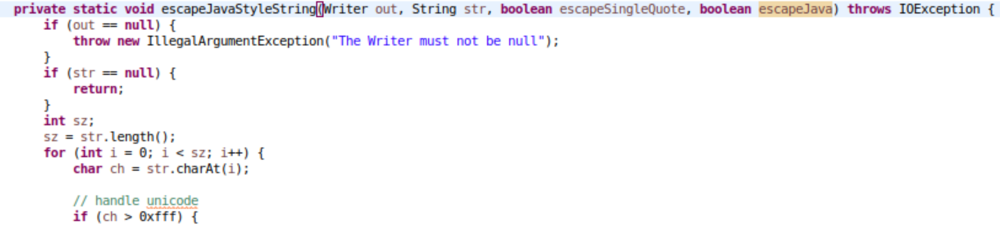

We can then add a condition for the additional escape character, like so:

```
case '/':
  if (escapeJava)
    out.write("\\");
  out.write("/");
```

After making this addition, there are a number of compiler errors that come up from statements that use the methods we changed. The other ```escapeJavaStyleString``` method needs the same parameter (as shown below).


We can now go to the calls to ```escapeJavaStyleString``` to add the new parameter values. We know where to go by the red markers in the 
right-hand gutter (see screenshot below). You can click each red marker to go to each method call.

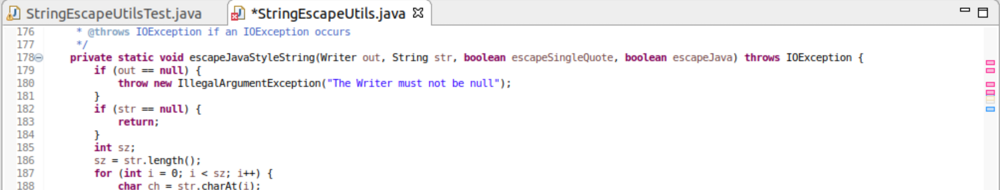

Two of these method calls happen within ```escapeJava``` methods; for these, we want to add ```false``` to the end of the parameter list like so:

```escapeJavaStyleString(str, false, false); ```

The other two methods that use ```escapeJavaStyleString``` are within ```escapeJavascript``` methods. Although we don't know for sure what the value for our new boolean should be when called from ```escapeJavascript```, we can speculate that this method is the reason the code for the character ```/``` exists. Therefore, we add ```true``` to the end of these parameter lists like so:

```escapeJavaStyleString(str, true, true); ```

Once we've addressed all the compiler errors in the ```StringEscapeUtils``` class, we are ready to test our fix. To do so, return to the test class ```StringEscapeutilsTest``` and click the green run button in the top menu bar (circled below). This will run the test suite to see if our test now passes.


A dialog will pop up asking you to "Select a way to run 'StringEscapeUtilsTest.java'". Select "JUnit Test" and click "Ok". 

**Success!** We can see in the JUnit view (shown below) that all tests passed, which means we have fixed the defect.

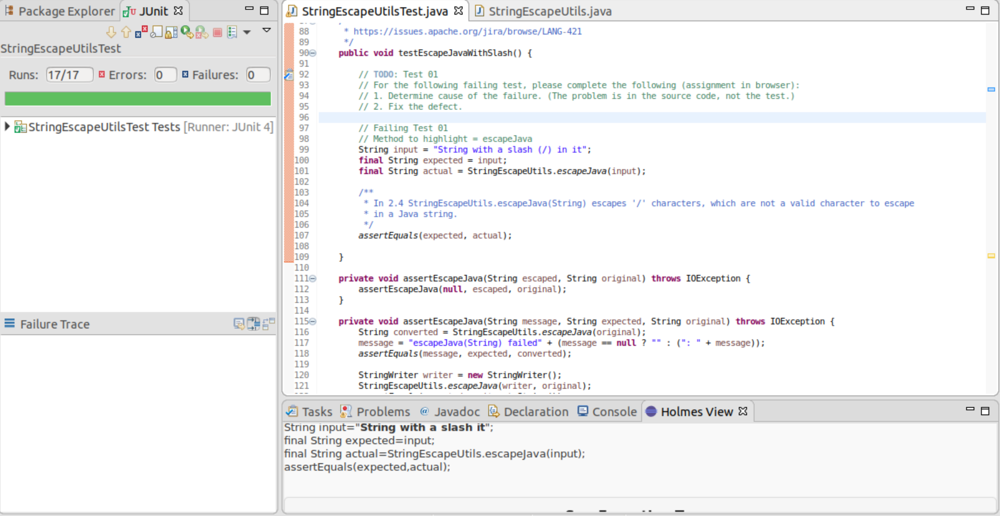


Repeat this process with *Defects 2-6* to see how Causal Testing can help with debugging other defects. 


