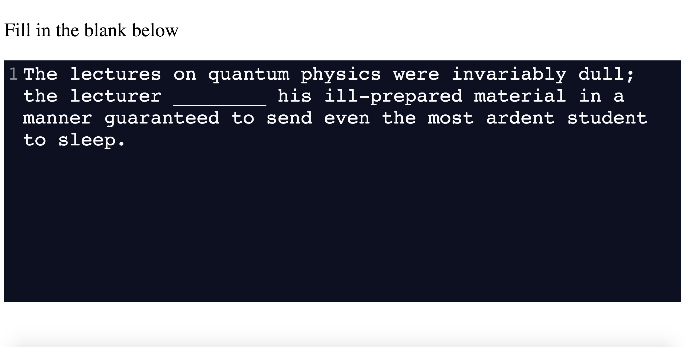

# CodeSynthViewer -- Install

CodeSynthViewer involves a [Node.js](https://nodejs.org/en/) back-end and a locally-hosted web-based front-end. Instructions for both installation and basic usage are outlined in the README of the repository, itself. However, we provide similar details here for the purpose of our submission: 

## Prerequisites and Installation

The Backend Server is built with [Node.js](https://nodejs.org/en/) and requires the following packages:
* http
* path
* request
* express
* fs
* shuffle-seed

The above packages should be installed using the [Node Package Manager](https://nodejs.org/en/knowledge/getting-started/npm/what-is-npm/) in the ```code-synth-viewer``` directory (e.g., ```cd path/to/code-synth-viewer; npm install shuffle-seed```). This will create a directory ```node_modules``` in ```code-synth-viewer```. 

## Getting Started

General usage for CodeSynthViewer involves a [Node.js](https://nodejs.org/en/) back-end and a locally-hosted web-based front-end. General usage requires the following steps:

1. Start the **Backend Server**, specifying the participant ID (used for a random number generator seed as well as for naming output files/directories) and the category (unique to the user's experimental design). Both are positive integers
2. Open the **Presenter** in a web browser
3. Press the designated key to start the experiment (default is "=")

To start the Backend Server, use

``node server.js [PARTICIPANT-ID] [CATEGORY]``

Then, open ``presenter.html`` in a web-browser. Lastly, press the designated start key. Below are sample images of expected behavior:

Rest Period             |  Active Stimulus
:-------------------------:|:-------------------------:
  |  

To replicate our experiments with a random ordering (e.g., random participant ID = 99), use the following commands:

* ``node server.js 99 [0-3]``
* ``open presenter.html``
* Press the "=" key

Note that we used four different categories of stimuli in our study. Each experiment can be run separately by selecting one of [0-3] as the category ID. In our study, the category IDs correspond to the following categories (FITB = Fill in the Blank, LR = Long Response):

0. Prose, FITB
1. Prose, LR
2. Code, FITB
3. Code, LR

The stimuli can be found in ```stimuli.json``` and are defined in this order.

