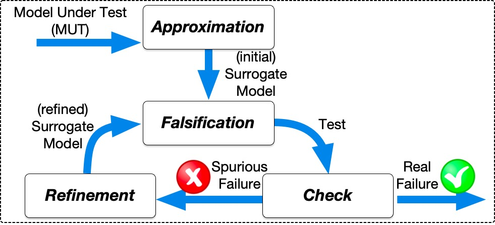
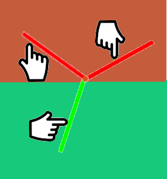

# ARIsTEO --- AppRoxImation-based TEst generatiOn

ARIsTEO (AbstRactIon based TEst generatiOn) is a novel testing framework that generates faulty test inputs for Compute Intensive Cyber-Physical Models in a automatic manner. ARIsTEO is based on an approximation-refinement loop.
It is a comprehensive framework that uses different existing tools and combines them to solve the test case generation problem in an effective manner.
Specifically, ARIsTEO learns from the CI-CPS model a non-CI-CPS surrogate model, which is used for generating a (faulty) input.
As the faulty input generated for the surrogate model can be spurious, a check on the original model is used to verify whether input is also faulty on the original model. If the input is spuriously faulty, the surrogate model is refined. Otherwise the faulty input is returned.

The approximation-refinement loop of ARIsTEO relies on the following inputs: a CI-CPS model  (i.e., the model under test—MUT), and the maximum number of iterations MAX_REF that can be executed by ARIsTEO. In the first iteration, an initial surrogate model MS is computed such that it approximates the MUT behavior. At every iteration, the algorithm applies falsification-based testing to the surrogate model in order to find a test input U violating the requirement captured by the test objective TObj. The number MAX of iterations of falsification-based testing is an internal parameter of ARIsTEO, and in general, can be set to a high value since executing MS is not expensive. Once U is found, the algorithm checks whether U leads to a violation when it is checked on the MUT. If the requirement is violated on the MUT U is returned as a failure-revealing test for M. Otherwise, U is spurious and in the next iteration it is used to refine the surrogate model MS. If no failure-revealing test for the MUT is found after MAX_REF iterations the algorithm stops and a null value is returned.

# Publications
- Approximation-Refinement Testing of Compute-Intensive Cyber-Physical Models: An Approach Based on System Identification 
<i>Menghi Claudio, Nejati Shiva, Lionel Briand, , Isasi Parache 
International Conference on Software Engineering, 2020  
</i>

# Content description
- ARIsTEO: contains ARIsTEO and the software we had developed for this project
- RQs: contains the scripts necessary to replicate our experiments
- Benchmarks: contains the benchmarks that are considered in our study
    * We cannot share the XXXEx case study as it is part of a non disclosure agreement (NDA)
- Results: contains the results of our experiments and the scripts that generate the results reported in the paper
- Tutorial: contains a simple example - a pendulum -  that shows how ARIsTEO works

## Prerequisite
- Matlab R2018a
- Matlab System Identification Toolbox

## Installation instructions
- open the folder ARIsTEO with Matlab
- add the folder ARIsTEO and all of its subfolders on your classpath (right click on the folder > add to path > selected folder and subfolders)
- open the folder ``staliro``
- run the command ``setup_staliro``

For a description of the parameters and the Usage of ARIsTEO type "``help aristeo``"  

## Running ARIsTEO --- The pendulum example
The pendulum is the simplest mechanical system you can model. This system contains two bodies, a link and a fixed pivot, connected by a revolute joint.
The input it the applied moment at every time instant (continuous signal representing the momentun applied to the pendulum at different time instants -- See figure on the left)

</>

The property of interest states that the pendulum should remain below the horizontal line that crosses the fixed pivot. When the pendulum goes above the horizontal line (red portion of the figure) the color of the pendulum changes from green to red.  

The goal of the testing activity is to search for a test input (force to be applied at the pendulum in different time instants) that violates this property (it reaches the red part of the figure).

By running the following commands a pendulum will be shown on the screen. Different simulations are performed where ARIsTEO searches for a a test input that violates the property. When a test input that violates the property is found  the pendulum changes its color from green to red, meaning that the property is violated and the test case generation stops.

``% Defines a variable that contains the name of the model`` 
``model='simppend';`` 

``% Considers the default initial conditions of the model`` 
``init_cond = [];`` 

``% Sets the input_range. We assume that the user can apply a momentun in the range [-0.5 0.5]`` 
``input_range = [-2 2];`` 

``% Sets the number of control points. We assume the inputs has 100 control points`` 
``cp_array = 100;``

``% Defines of the property of interest. The pendulum must remain below the horizontal line. The ARIsTEO testing framework searches for a test input that showing that the pendulum does not remain below the horizontal line. `` 
``phi='[]_[0,10000] (a/\b)';`` 
``preds(1).str = 'a';`` 
``preds(1).A = [1];`` 
``preds(1).b = [1.5];`` 
``preds(2).str = 'b';`` 
``preds(2).A = [-1];`` 
``preds(2).b = [1.5];`` 

``% Sets the simulation Time`` 
``TotSimTime=10;`` 

``% Creates the options of ARIsTEO`` 
``opt=aristeo_options();`` 

``% Sets the number of refinements rounds`` 
``opt.n_refinement_rounds=20;`` 

``%Sets the abstraction algorithm and its parameters`` 
``opt.fals_at_zero=0;`` 
``opt.abstraction_algorithm='ss';`` 
``opt.nx=2;`` 
``opt.optim_params.n_tests=10;`` 
``opt.dispinfo=1;`` 

``% Runs ARIsTEO`` 
``[resultsaristeo,inputaristeo] = aristeo(model, init_cond, input_range, cp_array, phi, preds, TotSimTime, opt);`` 

To see a comparison between ARIsTEO and STaliro execute the file ``AristeoTutorial.m``
