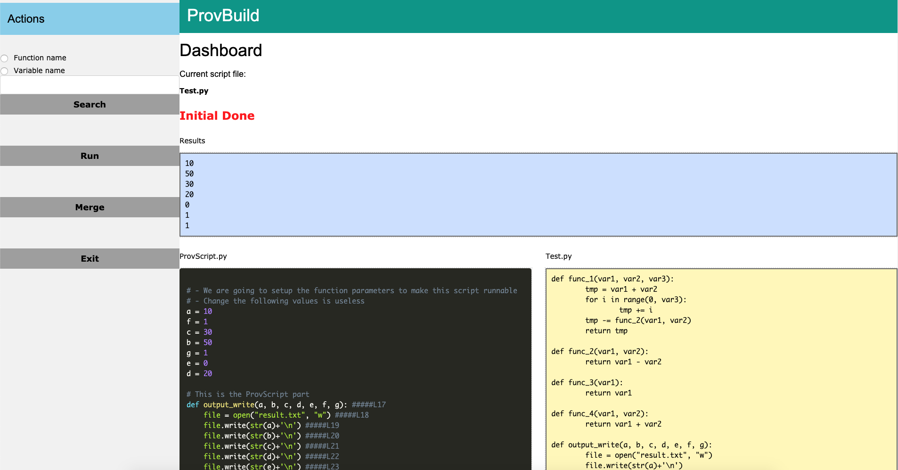

# ProvBuild

This is the artifact is for the paper: "Improving Data Scientist Efficiency with Provenance".

## Artifact Description

This artifact contains:

* A prototype tool of ProvBuild
	* Source code is available [here](https://github.com/CrystalMei/ProvBuild), no hidden links and access password.
* Documentation about ProvBuild installation and how to interact with ProvBuild.

## Documentation

ProvBuild is built on top of noWorkflow (Version 1.11.2). Check out [noWorkflow's Github](https://github.com/gems-uff/noworkflow) for more information details.

### Prerequisites
This version of ProvBuild only support **Python 2.7**.

To install ProvBuild, you should follow these basic instructions:

If you have python `pip`, install the following packages:

	$ pip install flask
	$ pip install sqlalchemy
	$ pip install pyposast
	$ pip install future
	$ pip install apted

### Clone the Repository

	$ git clone https://github.com/CrystalMei/ProvBuild.git
	$ cd ProvBuild

### Run ProvBuild Interface

- Step 1: Run `python app.py` and it will start a webpage as shown below:

- Step 2: Upload the test script `./example/Test.py`, then the webpage shows:

- Step 3: Interact with ProvBuild, e.g., exploring variable `e` in the test script.

## Github Link
[https://github.com/CrystalMei/ProvBuild](https://github.com/CrystalMei/ProvBuild)
