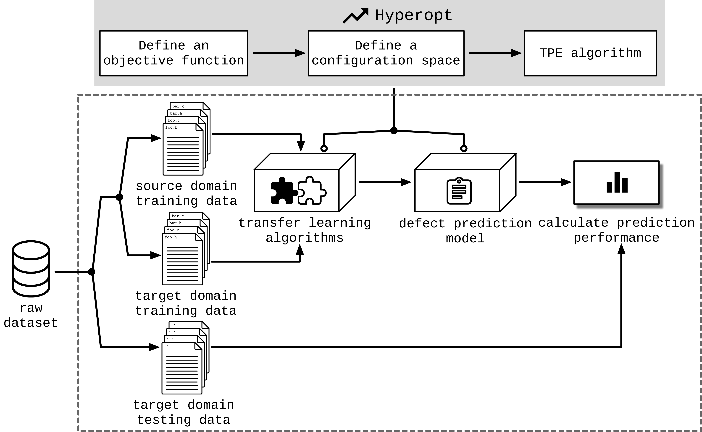

# Empirical Experimental Code

> This repository includes the code of the ICSE2020 paper："Understanding the Automated Parameter Optimization on Transfer Learning for Cross-Project Defect Prediction: An Empirical Study".

## Installation

Please read `INSTALL.md` .

## Investigated datasets

+ AEEEM
+ JURECZKO (12 selected projects)
+ ReLink

## The framework of the experiment

## Usage

> Please follow `INSTALL.md` before starting to run the code.

+ If you want to investigate the impact of parameter optimization on domain adpation part of CPDP, please run  `code\optADPT.py`;
+ If you want to investigate the impact of parameter optimization on classifiacation part of CPDP, please run `code\optCLF.py`;
+ If you want to investigate the impact of parameter optimization on whole parts of CPDP, please run `code\optALL.py`;
+ If you want to investigate the impact of parameter optimization on whole parts of CPDP but in a sequential way, please run `code\optSEQ.py`.

## scalability

> If you want to investigate more combinations (transfer learning algorithms + classification algorithms), please modify the following parts of code.

1. Add your transfer learning algorithms into `code\Algorithms\domainAdaptation.py`
2. Add your classification algorithms into `code\Algorithms\Classifier.py`
3. Modify the call format in `code\Alogrithms\Framework.py`

## Contact

If you meet any problems, please feel free to contact us. (From `CONTACT.md`, you can get our e-mails.) 
